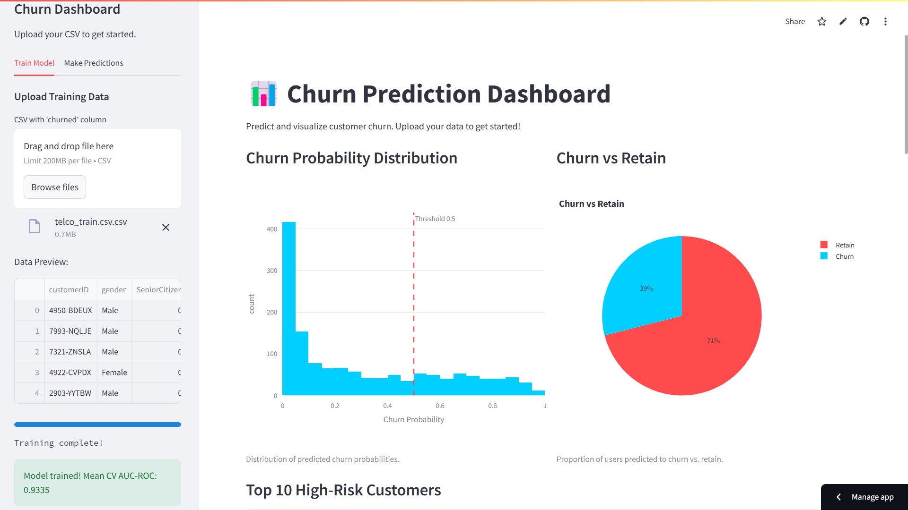

# Churn Prediction Dashboard

> **Predict. Understand. Take Action.**  
> A beautiful, robust, and explainable dashboard to help fintechs reduce customer churn—built for real business impact and hackathon excellence.

---

## 🚀 What is This?

Churn hurts. Our dashboard helps you fight back—by showing you not just **who** is likely to leave, but **why**.  
Upload your data, train a powerful model, and get instant, actionable insights—all in a few clicks.

---

## ✨ Key Features

- **Ensemble Machine Learning:** Combines XGBoost, LightGBM, and RandomForest for top-tier accuracy.
- **Smart Data Handling:** Cleans, encodes, and scales your data automatically—even if it's messy.
- **Explainable AI:** See which features drive churn, with interactive SHAP and feature importance plots.
- **Beautiful UI:** Modern Streamlit dashboard—easy for anyone to use.
- **Instant Results:** Upload, train, predict, and download—all in minutes.
- **Visual Insights:** Churn probability histograms, pie charts, risk tables, and more.
- **One-Click Reset:** Start over anytime.

---

## 🛠️ Getting Started

1. **Clone the repo**
   ```bash
   git clone <your-repo-url>
   cd <your-repo-folder>
   ```
2. **Install dependencies**
   ```bash
   pip install -r requirements.txt
   ```
3. **Run the dashboard**
   ```bash
   streamlit run app.py
   ```

---

## 📊 How It Works

1. **Train Your Model**
   - Go to the **Train Model** tab.
   - Upload your labeled CSV (must include a `churned` column).
   - See your AUC-ROC score and feature insights.

2. **Make Predictions**
   - Go to **Make Predictions**.
   - Upload your test CSV (same features as training, no `churned` needed).
   - Download your predictions as CSV.

3. **Explore & Explain**
   - Visualize churn risk, feature importance, and SHAP explanations.
   - Identify your top 10 high-risk customers.

---

## 🧠 Under the Hood

- **Model:** Stacking ensemble (XGBoost, LightGBM, RandomForest)
- **Feature Engineering:**  
  - Average charges per month  
  - Tenure groups  
  - Senior+Fiber interaction
- **Imbalance Handling:** SMOTE oversampling
- **Validation:** 5-fold stratified cross-validation
- **Explainability:** SHAP values, feature importance

---

## 🖼️ Screenshots



---

## 🎥 Demo

[Watch the demo](https://your-demo-link.com)

---

## 👥 Team

Made with ❤️ for the DS-2 Hackathon  
**Team:** Sarthak Raha  
[GitHub](https://github.com/your-repo)

---

## 📄 License

MIT

---

## 📂 Project Structure

- `ensemble_model.py`: Advanced ensemble ML model
- `churn_model.py`: (Legacy) XGBoost model
- `app.py`: Streamlit dashboard application
- `utils.py`: Helper functions
- `requirements.txt`: Project dependencies

---

## 📈 Model Performance

- Optimized for AUC-ROC score
- Feature importance and SHAP explainability
- Robust cross-validation results

---

## 📚 Data

Uses the telco dataset with behavioral and transactional features.  
Handles missing values and categorical variables automatically.

---

## 🙏 Thanks for Visiting!

If you have questions, feedback, or want to collaborate, open an issue or reach out.  
**Good luck to all hackathon teams!**

contact details :- aerraj50@gmail.com
linkedin :- https://www.linkedin.com/in/aman-jaiswal-05b962212/


